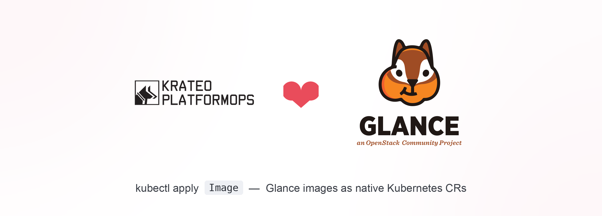

<p align="center">
  
</p>

# openstack-glance-operator-kog

Krateo Operator Generator (KOG) packaging that turns **OpenStack Glance (image v2)** resources
into native Kubernetes custom resources — no hand-written controller, just a curated OpenAPI subset
per resource and a generic `rest-dynamic-controller`.

## Resources

| Kind | Glance API | Verbs |
|------|------------|-------|
| `Image` | `/v2/images` | create (metadata) / get / delete |
| `ImageImport` | `POST /v2/images/{id}/import` | web-download import (single-fire) |
| `ImageMember` | `/v2/images/{id}/members` | share / get / unshare |

Glance v2 is **flat JSON** (no envelope), so there's no crdgen Kind-vs-property collision and the
Kinds are unprefixed.

### Two Glance realities to know
- **No `update` verb.** Glance image update is **JSON-Patch only**
  (`application/openstack-images-v2.1-json-patch`), which KOG cannot emit — change an image by
  delete + recreate (same constraint as the Ironic operator's `Node`).
- **Binary upload is out of KOG's reach.** `PUT /v2/images/{id}/file` is an octet-stream upload, not
  JSON. So `Image` creates the **metadata** (status `queued`); to get a usable (`active`) image,
  apply an **`ImageImport`** with `method: web-download` and a source `uri` — Glance fetches the data
  itself. (Requires the `web-download` import method enabled on the Glance deployment.)

## Auth: the openstacksdk proxy (auto-refreshing)

Ships the same **auth-bridge** as the other operators (`scripts/openstack-auth-proxy.py`,
`SERVICE_TYPE=image`): authenticates with `clouds.yaml`, discovers the `image` endpoint, injects a
fresh auto-refreshing `X-Auth-Token`, in-cluster-safe.

```bash
kubectl create secret generic glance-clouds --from-file=clouds.yaml=clouds.yaml -n krateo-system
helm upgrade --install glance-kog ./chart -n krateo-system \
  --set authBridge.upstreamEndpoint=http://glance-api.openstack.svc.cluster.local:9292
kubectl -n krateo-system apply -f chart/samples/image-resources.yaml
```

## What's in here

```
chart/
  Chart.yaml
  values.yaml                 # per-resource toggles + auth-bridge config
  assets/
    image.yaml image-import.yaml image-member.yaml
  scripts/
    openstack-auth-proxy.py
  templates/
    configmap-*.yaml  rd-*.yaml  auth-bridge-*.yaml
  samples/
    image-resources.yaml
```

## License

Apache-2.0 — see [LICENSE](LICENSE).
