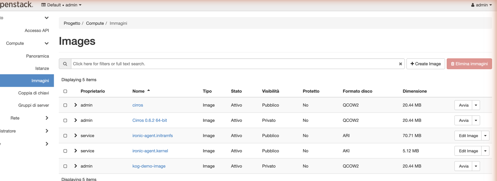

# Quickstart — Glance (image) operator

Manage OpenStack **Glance** images as Kubernetes CRs. End to end: install the
operator, `kubectl apply` an `Image` plus an `ImageImport` (web-download), and watch
the image go **active** in the Horizon dashboard — no binary upload needed.

## 1. Prerequisites

Krateo's KOG provider in the cluster:

```bash
helm repo add krateo https://charts.krateo.io && helm repo update
helm upgrade --install oasgen-provider krateo/oasgen-provider -n krateo-system --create-namespace
```

An admin `clouds.yaml` for your OpenStack, stored in a Secret:

```bash
kubectl -n krateo-system create secret generic glance-clouds --from-file=clouds.yaml=clouds.yaml
```

## 2. Install the operator

```bash
helm upgrade --install glance-kog ./chart -n krateo-system \
  --set authBridge.upstreamEndpoint=http://glance-api.openstack.svc.cluster.local:9292
kubectl -n krateo-system wait restdefinition/glance-kog-image --for=condition=Ready --timeout=300s
```

## 3. Create an image and populate it

`Image` creates the metadata (status `queued`); `ImageImport` (web-download) tells
Glance to fetch the data from a URL — the KOG-friendly way to get an `active` image
(the binary `PUT .../file` upload is octet-stream, out of KOG's reach).

```bash
kubectl -n krateo-system create secret generic glance-token --from-literal=token=managed-by-proxy
cat <<'EOF' | kubectl apply -f -
apiVersion: image.openstack.krateo.io/v1alpha1
kind: ImageConfiguration
metadata: {name: glance-config, namespace: krateo-system}
spec: {authentication: {bearer: {tokenRef: {name: glance-token, namespace: krateo-system, key: token}}}}
---
apiVersion: image.openstack.krateo.io/v1alpha1
kind: Image
metadata: {name: kog-demo-image, namespace: krateo-system}
spec:
  configurationRef: {name: glance-config, namespace: krateo-system}
  name: kog-demo-image
  disk_format: qcow2
  container_format: bare
  visibility: private
EOF

# read the image id, then import data from a URL
IMGID=$(kubectl -n krateo-system get image.image.openstack.krateo.io kog-demo-image -o jsonpath='{.status.id}')
cat <<EOF | kubectl apply -f -
apiVersion: image.openstack.krateo.io/v1alpha1
kind: ImageImport
metadata: {name: kog-demo-import, namespace: krateo-system}
spec:
  configurationRef: {name: glance-config-import, namespace: krateo-system}   # an ImageImportConfiguration
  image_id: "$IMGID"
  method:
    name: web-download
    uri: "https://download.cirros-cloud.net/0.6.2/cirros-0.6.2-x86_64-disk.img"
EOF
```

## 4. See it in Horizon

After the web-download completes, the image is **Active** under **Compute → Images**:



Share it with another project with an `ImageMember`.
